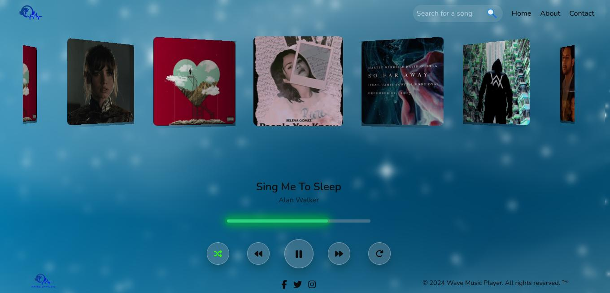

# Wave Music Player


Wave Music Player is a sleek and intuitive web application for playing your favorite tunes. It offers a user-friendly interface and a range of features to enhance your listening experience.

## 💻 Tech Stack:
 
[](https://img.shields.io/badge/JavaScript-333333?style=plastic&logo=javascript)
[](https://img.shields.io/badge/CSS-1572B6?style=plastic&logo=css3&logoColor=white)


## Features

- **Search Functionality**: Easily find your favorite songs with the search feature.
- **Album Cover Slider**: View album covers in a stylish carousel.
- **Music Player Controls**: Play, pause, shuffle, and skip tracks with ease.
- **Responsive Design**: Enjoy a seamless experience on any device.

## Demo

[Live Demo](https://wave-music-player.onrender.com/)

## Screenshots

<p align="center"  >
  
</p>


## Installation

1. Clone the repository:

   ```bash
   git clone https://github.com/d10xi24/wave-music-player.git
   ```

2. Navigate to the project directory:

   ```bash
   cd wave-music-player
   ```

3. Install dependencies:

   ```bash
   npm install
   ```

4. Run the application:

   ```bash
   node app.cjs
   ```

5. Open your web browser and navigate to `http://localhost:3000` to access the Wave Music Player.

## Contributing

Contributions are welcome! Please fork the repository and submit a pull request with your changes.

## License

This project is licensed under the [ISC License](LICENSE).

## Acknowledgements

- [Font Awesome](https://fontawesome.com/) for the beautiful icons.
- [Swiper](https://swiperjs.com/) for the carousel slider.
